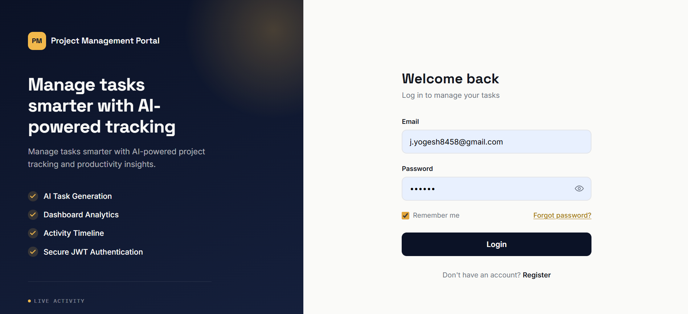
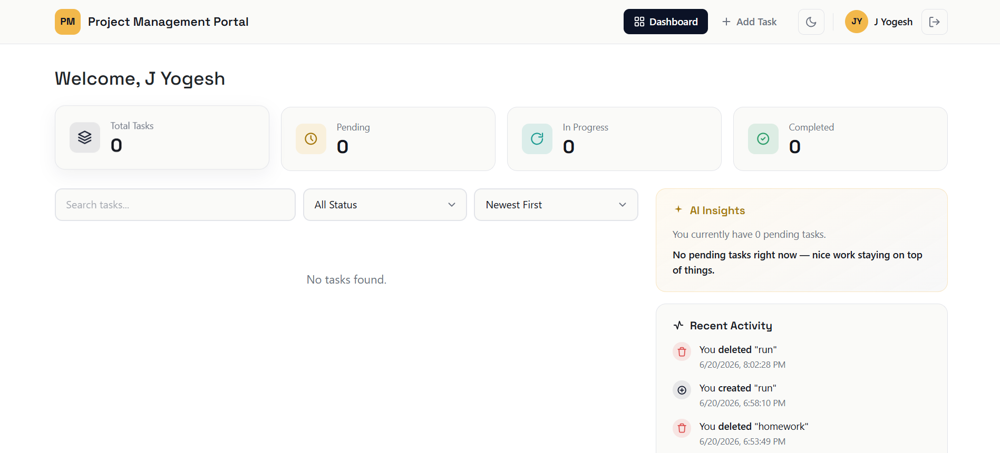
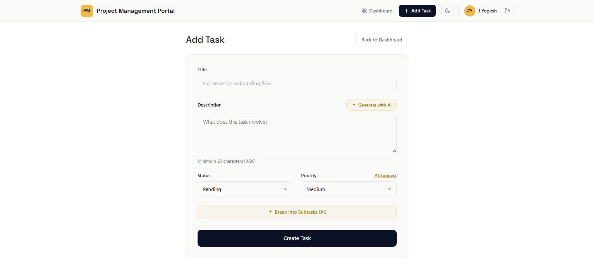
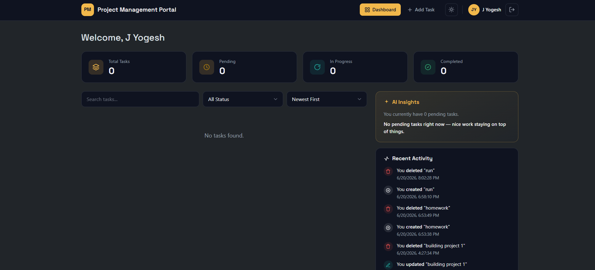

# Project Management Portal

A full-stack task and project management web app built for the OH2 hiring assessment. Users can register, log in, and manage tasks with search, filter, sort, and pagination — plus AI-assisted task creation, dashboard statistics, an activity timeline, and dark mode.

## Tech Stack

**Frontend:** React.js (Vite), Bootstrap 5, Axios, React Router
**Backend:** Node.js, Express.js, MongoDB, Mongoose
**Auth:** JWT (JSON Web Tokens)
**AI:** Google Gemini API
**Email:** Nodemailer (Gmail SMTP) — for password reset emails

## Features

- User registration and login with JWT authentication
- Forgot password / reset password via emailed reset link
- Dashboard with live statistics (total, pending, in progress, completed)
- Add, edit, complete, and delete tasks
- Search tasks by title/description
- Filter tasks by status
- Sort tasks by newest/oldest
- Pagination on the task list
- Dark mode (persisted across sessions)
- Activity timeline (recent created/updated/completed/deleted actions)
- AI Task Description Generator
- AI Task Breakdown Assistant (suggests subtasks)
- AI Priority Recommendation
- AI Productivity Insights (dashboard suggestion widget)

## Screenshots

| Login |
|---|
|  | 

| Dashboard |
|---|
 |

| Add Task |
|---|
|  |

| Dark Mode |
|---|
|  |


## Project Structure

```
project-root/
├── frontend/          # React + Vite app
│   └── src/
│       ├── components/
│       ├── pages/
│       ├── services/
│       ├── context/
│       └── hooks/
└── backend/           # Express + MongoDB API
    ├── models/
    ├── controllers/
    ├── routes/
    ├── middleware/
    └── utils/
```

## Setup Steps

### Prerequisites
- Node.js (v18 or higher)
- MongoDB running locally (or a MongoDB Atlas connection string)
- A Google Gemini API key ([Google AI Studio](https://aistudio.google.com/))
- A Gmail account with an [App Password](https://myaccount.google.com/apppasswords) for sending reset emails

### 1. Clone the repository
```bash
git clone <your-repo-url>
cd project-root
```

### 2. Backend setup
```bash
cd backend
npm install
```

Create a `.env` file in `backend/` with the following:
```
PORT=5000
MONGO_URI=mongodb://127.0.0.1:27017/pm-portal
JWT_SECRET=your_long_random_secret
JWT_EXPIRES_IN=7d
GEMINI_API_KEY=your_gemini_api_key
EMAIL_USER=your_gmail_address@gmail.com
EMAIL_PASS=your_gmail_app_password
CLIENT_URL=http://localhost:5173
```

Run the backend:
```bash
npm run dev
```
The API will be available at `http://localhost:5000`.

### 3. Frontend setup
```bash
cd frontend
npm install
```

Create a `.env` file in `frontend/` with:
```
VITE_API_URL=http://localhost:5000/api
```

Run the frontend:
```bash
npm run dev
```
The app will be available at `http://localhost:5173`.

## Assumptions

- MongoDB is assumed to be running locally on the default port; no cloud database is pre-configured.
- AI features (description generation, task breakdown, priority recommendation, productivity insights) are powered by the Google Gemini API and require a valid API key. If the key is missing or the request fails, these features will return an error rather than silently falling back.
- JWT tokens are stored in `localStorage` on the client for simplicity. A production deployment would typically use httpOnly cookies instead.
- Task descriptions require a minimum of 20 characters, per the original project specification.
- Tasks are private per user — each task is scoped to the logged-in user via `userId`, and one user cannot see or modify another user's tasks.
- Password reset emails require valid Gmail SMTP credentials (an App Password, not the account's regular password) to be configured in the backend `.env`.
- No file storage service (e.g. S3/Cloudinary) is used anywhere in the app; all data is stored directly in MongoDB.

## API Documentation

Base URL: `http://localhost:5000/api`

### Auth Routes (`/api/auth`)

| Method | Endpoint | Protected | Description |
|---|---|---|---|
| POST | `/auth/register` | No | Register a new user. Body: `{ name, email, password }` |
| POST | `/auth/login` | No | Log in. Body: `{ email, password }`. Returns JWT + user info |
| GET | `/auth/me` | Yes | Get the currently logged-in user's profile |
| POST | `/auth/forgot-password` | No | Send a password reset email. Body: `{ email }` |
| PUT | `/auth/reset-password/:token` | No | Reset password using the emailed token. Body: `{ password }` |

### Task Routes (`/api/tasks`)
All task routes require a valid JWT in the `Authorization: Bearer <token>` header.

| Method | Endpoint | Description |
|---|---|---|
| POST | `/tasks` | Create a new task. Body: `{ title, description, status, priority }` |
| GET | `/tasks` | Get tasks. Query params: `search`, `status`, `sort` (`newest`/`oldest`), `page`, `limit` |
| PUT | `/tasks/:id` | Update a task (also used to mark complete). Body: any of `{ title, description, status, priority }` |
| DELETE | `/tasks/:id` | Delete a task |
| GET | `/tasks/stats` | Get task counts: `{ total, pending, inProgress, completed }` |

### Activity Routes (`/api/activity`)

| Method | Endpoint | Protected | Description |
|---|---|---|---|
| GET | `/activity` | Yes | Get the 20 most recent activity log entries for the logged-in user |

### AI Routes (`/api/ai`)
All AI routes require a valid JWT and are powered by the Google Gemini API.

| Method | Endpoint | Description |
|---|---|---|
| POST | `/ai/generate-description` | Generate a task description. Body: `{ title }` |
| POST | `/ai/breakdown` | Break a task into suggested subtasks. Body: `{ title }` |
| POST | `/ai/priority` | Recommend a priority level. Body: `{ title, description }` |
| GET | `/ai/insights` | Get productivity insights and a suggested next task |

### Data Models

**User**
| Field | Type | Notes |
|---|---|---|
| name | String | required |
| email | String | required, unique |
| password | String | required, bcrypt-hashed |
| createdAt / updatedAt | Date | auto (timestamps) |

**Task**
| Field | Type | Notes |
|---|---|---|
| title | String | required |
| description | String | required, min 20 characters |
| status | String | `Pending` \| `In Progress` \| `Completed` |
| priority | String | `Low` \| `Medium` \| `High` |
| userId | ObjectId | references User |
| createdAt / updatedAt | Date | auto (timestamps) |

**Activity**
| Field | Type | Notes |
|---|---|---|
| user | ObjectId | references User |
| task | ObjectId | references Task (null if task was later deleted) |
| taskTitle | String | snapshot, kept even after deletion |
| action | String | `created` \| `updated` \| `completed` \| `deleted` |
| createdAt | Date | auto (timestamps) |

## Suggested Commit History

This project was built incrementally; a typical commit sequence looked like:

```
Initial project setup
Implemented task APIs
Added React Dashboard
Integrated frontend with backend
Added AI features (description, breakdown, priority, insights)
Added forgot/reset password flow
Updated README
```

## Author

Built as a submission for the OH2 hiring assessment.
